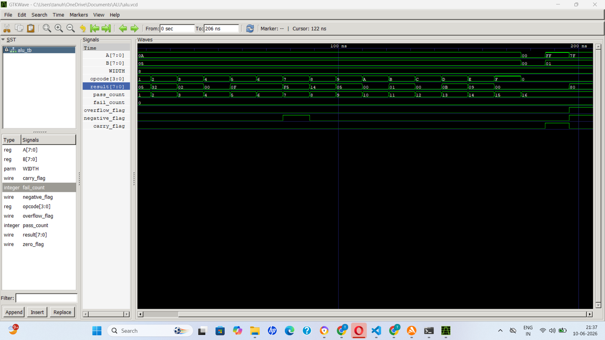

# 8-Bit Parameterized ALU in Verilog

## Overview

This project implements an 8-bit Arithmetic Logic Unit (ALU) in Verilog.

The ALU performs arithmetic, logical, shift, comparison, increment/decrement, and modulus operations. It also generates important status flags used in processor design such as Zero, Negative, Carry, and Overflow flags.

The design is parameterized, allowing the ALU width to be easily changed from 8-bit to 16-bit, 32-bit, or larger without modifying the core logic.

---

## Features

### Arithmetic Operations
- Addition
- Subtraction
- Multiplication
- Division
- Modulus

### Logical Operations
- AND
- OR
- XOR
- NOT

### Shift Operations
- Left Shift
- Right Shift

### Comparison Operations
- Equal To
- Greater Than
- Less Than

### Additional Operations
- Increment
- Decrement

---

## Status Flags

### Zero Flag
Asserted when the result is zero.

### Negative Flag
Asserted when the most significant bit (MSB) of the result is 1.

### Carry Flag
Asserted when an addition operation produces a carry-out.

Example:

255 + 1 = 256

The ALU outputs:

Result = 0

Carry = 1

### Overflow Flag
Asserted when signed arithmetic exceeds the representable range.

Example:

127 + 1 = 128

For signed 8-bit arithmetic this causes overflow.

---

## Supported Opcodes

| Opcode | Operation |
|----------|----------|
| 0000 | ADD |
| 0001 | SUB |
| 0010 | MUL |
| 0011 | DIV |
| 0100 | AND |
| 0101 | OR |
| 0110 | XOR |
| 0111 | NOT |
| 1000 | LEFT SHIFT |
| 1001 | RIGHT SHIFT |
| 1010 | EQUAL |
| 1011 | GREATER THAN |
| 1100 | LESS THAN |
| 1101 | INCREMENT |
| 1110 | DECREMENT |
| 1111 | MODULUS |

---

## Parameterization

The ALU width can be modified using:

```verilog
parameter WIDTH = 8;
```

Examples:

```verilog
alu #(16) uut (...);
```

creates a 16-bit ALU.

```verilog
alu #(32) uut (...);
```

creates a 32-bit ALU.

---

## Verification

The design was verified using:

- Icarus Verilog
- GTKWave

The testbench checks:

- All ALU operations
- Zero flag functionality
- Carry flag functionality
- Overflow flag functionality

Simulation Result:

```text
TOTAL PASS = 16
TOTAL FAIL = 0
```

---

## Waveform Verification

Waveforms were generated using:

```verilog
$dumpfile("alu.vcd");
$dumpvars(0, alu_tb);
```

and analyzed in GTKWave.


---

## Tools Used

- Verilog 
- Icarus Verilog
- GTKWave
- Visual Studio Code
- Git & GitHub

---

## Future Improvements

- Signed arithmetic support
- Barrel shifter
- Rotate operations
- Saturation arithmetic
- Verilog testbench
- UVM-based verification
- Integration into a simple CPU datapath

---

## Author

Tanushri Ravi

Electronics Engineering (VLSI)

VIT Chennai
